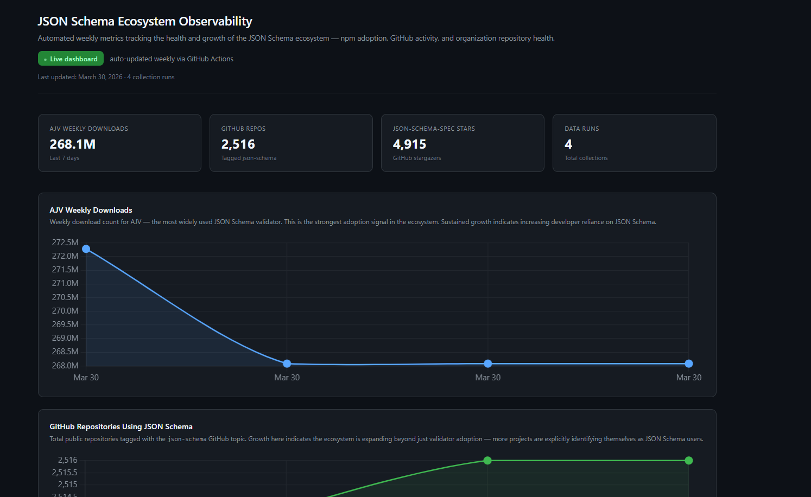
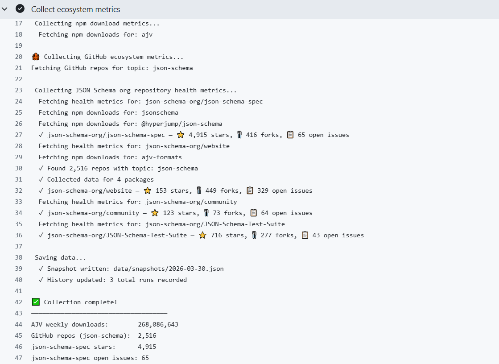

# JSON Schema Ecosystem Observability

> GSoC 2026 Qualification Task — [Ecosystem Observability #980](https://github.com/json-schema-org/community/issues/980)

An automated pipeline that collects, stores, and visualizes metrics about
the JSON Schema ecosystem. Runs weekly via GitHub Actions with zero manual
intervention — no servers, no external hosting, no installation required
beyond the repository itself.

---

## Live Dashboard

📊 **[View the live visualization →](https://jnjerin.github.io/json-schema-observability/visualization/)**



---

## What This Tracks

Three metric sources, each measuring a different dimension of ecosystem health:

| Metric | Source | Signal |
|--------|--------|--------|
| npm weekly downloads | npm registry API | Validator adoption trends |
| GitHub repo count | GitHub Search API | Ecosystem breadth and growth |
| Org repository health | GitHub REST API | JSON Schema org vitality |

**Current readings** *(as of last collection run)*:
- **AJV weekly downloads:** ~268M — the dominant JSON Schema validator
- **GitHub repos tagged `json-schema`:** 2,516 and growing (~3/day)
- **json-schema-spec stars:** 4,915 — steady community interest
- **json-schema-org/website:** 449 forks, 329 open issues — high contributor activity

---

## How It Works
```
GitHub Actions (every Sunday, midnight UTC)
        │
        ▼
Collection pipeline (TypeScript/Node.js)
   ├── npm registry API  → validator download counts
   ├── GitHub Search API → repo topic counts  
   └── GitHub REST API   → org repo health metrics
        │
        ▼
Structured JSON storage (committed to this repo)
   ├── data/snapshots/YYYY-MM-DD.json  → full snapshot per run
   └── data/history.json               → lightweight longitudinal log
        │
        ▼
Static HTML visualization (Chart.js)
   └── visualization/index.html        → auto-reflects new data
```

The pipeline is entirely self-contained. When GitHub Actions runs, it
checks out the repo, collects metrics, commits new data files, and pushes.
The visualization reads `history.json` directly — no rebuild needed.

### GitHub Actions Run



---

## Project Structure
```
json-schema-observability/
├── src/
│   ├── collectors/
│   │   ├── npm.ts          # npm weekly downloads collector
│   │   ├── github.ts       # GitHub topic repo count collector
│   │   ├── orgHealth.ts    # JSON Schema org repo health collector
│   │   └── bowtie.ts       # Preserved investigation artifact (see note)
│   ├── storage/
│   │   └── writer.ts       # JSON snapshot and history writer
│   ├── types.ts            # Shared TypeScript interfaces
│   └── index.ts            # Main orchestrator
├── data/
│   ├── snapshots/          # Full JSON snapshot per collection run
│   └── history.json        # Append-only longitudinal history log
├── visualization/
│   └── index.html          # Self-contained Chart.js dashboard
├── .github/
│   └── workflows/
│       └── collect.yml     # Weekly automation workflow
└── docs/
    ├── evaluation.md       # Part 2: evaluation of existing code
    ├── decisions.md        # Architectural decisions and tradeoffs
    └── analysis.md         # Part 1: metric analysis and written answers
```

---

## Running Locally

### Prerequisites

- Node.js 18 or higher
- A GitHub Personal Access Token with `public_repo` scope

### Setup
```bash
# Clone the repository
git clone https://github.com/jnjerin/json-schema-observability.git
cd json-schema-observability

# Install dependencies
npm install

# Configure environment
cp .env.example .env
# Edit .env and add your GitHub token:
# GITHUB_TOKEN=your_token_here
```

### Run the collection pipeline
```bash
npm run collect
```

Expected output:
```
🔍 JSON Schema Ecosystem Observability
======================================
Run started: 2026-03-30T12:27:58.970Z
Run ID: 2d0f7cde-...

📦 Collecting npm download metrics...
  Fetching npm downloads for: ajv
  ✓ Collected data for 4 packages

🐙 Collecting GitHub ecosystem metrics...
  ✓ Found 2,514 repos with topic: json-schema

🏥 Collecting JSON Schema org repository health metrics...
  ✓ json-schema-org/json-schema-spec — ⭐ 4,914 stars
  ✓ json-schema-org/website — ⭐ 153 stars
  ✓ json-schema-org/community — ⭐ 123 stars
  ✓ json-schema-org/JSON-Schema-Test-Suite — ⭐ 716 stars

💾 Saving data...
  ✓ Snapshot written: data/snapshots/2026-03-30.json
  ✓ History updated: 2 total runs recorded

✅ Collection complete!
```

Results are written to `data/snapshots/` and `data/history.json`.

### View the visualization locally

The visualization fetches `history.json` at runtime, so it needs a
local server rather than direct file access:
```bash
npx serve .
```

Then open: `http://localhost:3000/visualization/`

---

## How It Runs in Production

A GitHub Actions workflow triggers the collection pipeline every Sunday
at midnight UTC. The workflow:

1. Checks out the repository
2. Installs dependencies (`npm ci`)
3. Runs `npm run collect` with `GITHUB_TOKEN` injected from Actions secrets
4. Commits and pushes updated data files back to the repository
5. Skips the commit if no data changed (prevents empty commits)

No external hosting, no database, no persistent server. The repository
is both the code and the data store — exactly as described in the
project vision.

---

## Qualification Task Deliverables

### Part 1: Proof-of-Concept

| Requirement | Delivered |
|------------|-----------|
| Script fetches data from appropriate APIs | ✅ Three collectors: npm, GitHub Search, GitHub REST |
| Outputs structured JSON to a file | ✅ `data/snapshots/` and `data/history.json` |
| Basic error handling | ✅ Fail-fast for core collectors, documented nullable strategy |
| README with run instructions | ✅ This document |
| Simple visualization | ✅ Chart.js dashboard at `visualization/index.html` |
| What does this metric tell us? | ✅ `docs/analysis.md` |
| How would you automate this weekly? | ✅ `docs/analysis.md` + working GitHub Actions workflow |
| Challenges faced and solution | ✅ `docs/analysis.md` |

### Part 2: Evaluation of Existing Code

| Requirement | Delivered |
|------------|-----------|
| What does it do well? | ✅ `docs/evaluation.md` |
| What are its limitations? | ✅ `docs/evaluation.md` - six specific bugs with line references |
| Did you try running it? | ✅ Yes - silent failure, no output, no data produced |
| Should we build on it or start fresh? | ✅ Start fresh - full reasoning in `docs/evaluation.md` |

---

## Key Design Decisions

Full reasoning for every decision is in [`docs/decisions.md`](./docs/decisions.md).
Short version:

- **TypeScript** over JavaScript — three of the existing code's bugs
  are caught at compile time with proper types
- **JSON** over CSV — self-describing, nestable, visualization-ready
- **Two storage layers** — full snapshots for completeness, history
  file for fast trend queries
- **Sequential collection** — predictable error attribution over
  marginal speed gains
- **`GITHUB_TOKEN`** over PAT — scoped to repo, auto-rotated,
  more secure for automated workflows
- **Org health over Bowtie** — Bowtie has no public REST API;
   investigation documented in [`src/collectors/bowtie.ts`](./src/collectors/bowtie.ts)

---

## A Note on Bowtie

Bowtie was planned as a third metric source. After investigation,
Bowtie has no public REST API — it is a CLI tool that runs
implementations inside Docker containers. The correct integration
path is via Bowtie's official GitHub Action. This is documented
as a planned enhancement. See [`src/collectors/bowtie.ts`](./src/collectors/bowtie.ts) for
the full investigation trail and [`docs/decisions.md`](./docs/decisions.md) (Decision 8)
for the architectural reasoning.

---

## AI Assistance

I used AI tools (Claude by Anthropic) during development for tasks such as architectural exploration, debugging assistance, reviewing approaches, and structuring documentation.

All implementation decisions, code, and documentation are my own. I verified suggestions against official documentation and real system behavior, and questioned or corrected outputs that were inaccurate.

---

## Documentation

- [`docs/evaluation.md`](./docs/evaluation.md) — Part 2: evaluation of
  the existing `projects/initial-data/` proof-of-concept
- [`docs/decisions.md`](./docs/decisions.md) — Architectural decisions
  and tradeoffs made during development
- [`docs/analysis.md`](./docs/analysis.md) — Part 1 written answers:
  what each metric means, automation approach, challenges faced